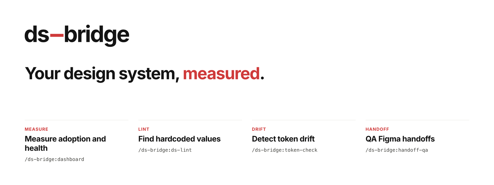

<p align="center">
  <picture>
    <source media="(prefers-color-scheme: dark)" srcset=".github/assets/readme-hero-dark.png">
    
  </picture>
</p>

<p align="center">
  <a href="https://ds-bridge.com">Website</a> ·
  <a href="https://ds-bridge.com/install">Install</a> ·
  <a href="https://ds-bridge.com/docs">Docs</a> ·
  <a href="https://ds-bridge.com/example/dashboard.html">Example dashboard</a> ·
  <a href="https://github.com/lucksy/ds-bridge/releases">Releases</a>
</p>

# DS Bridge

**Design-system analytics inside Claude Code.** DS Bridge measures how much of
your product really uses the design system, tracks its health over time —
recorded automatically in CI, rolled up across repos, exported to your
spreadsheet — and finds and fixes what's off-system: **token drift detection**,
**design-system-aware linting**, **system-first design-to-code**, and
**pre-handoff QA**, with rich terminal output and a self-contained HTML
dashboard.

The brain is a standalone CLI (`ds-bridge`, bundled to a single
`dist/cli.mjs`). Slash commands are thin wrappers over it, so the same engine
runs inside Claude Code, on your machine, and in CI. Works with **Figma
Professional+** (the remote Figma MCP server is available on all plans).

> **Status:** released and free to use — the current version and its notes
> are on the [releases page](https://github.com/lucksy/ds-bridge/releases).
> Strict TDD. Website and docs: **<https://ds-bridge.com>**.

## Who it serves

- **DS developers** — stop re-deriving tokens and components by hand; catch
  off-system code at the door, before it lands in a PR.
- **DS designers** — validate that designs are machine-readable before handoff;
  see the code impact of token changes.
- **DS managers** — track the system score, adoption, drift and handoff
  readiness as real metrics: history recorded by CI, a one-page manager report,
  an org rollup across repos, and CSV/JSON export for Sheets or BI.

The architecture treats **the repo as the source of truth** (W3C / Tokens
Studio / Style Dictionary token files) and uses Figma to *validate designs
against it* — no Enterprise Variables API, Library Analytics, or Code Connect
required.

## Design-system analytics

The checks are the sensors; the analytics are the product. Every check run is
saved to your repo's history, and the analytics replay it into trends.

**What is measured**

| Metric | From | Shown in |
|---|---|---|
| **System score** (0–100, weighted: drift, lint, readiness, contrast, adoption, parity) — stored with its weights on every `record` run | all checks | dashboard, badge, manager report, rollup |
| **On-system %** (styling that uses tokens) and its trend, by directory | `lint` | dashboard, digest, manager report |
| **Import coverage** (registry components your code imports) | `adoption` | dashboard, manager report |
| **Token drift** (stale / missing / orphan) and **contrast** (WCAG AA over token pairs) | `tokens check`, `a11y` | dashboard, rollup |
| **Handoff readiness** per Figma frame, the **pass rate**, and each frame's trend | `handoff` | dashboard, manager report |
| **Parity** (Figma ↔ code) and **library health** (overrides, deprecated use, detached candidates) with per-component **hotspot trends** | `registry build`, `library-health` | dashboard |
| **Consistency** (0–100) and the **design-debt index** (0–100, weighted, capped) | derived | dashboard, `analytics`, manager report |

Anything never recorded reads "not measured", never 0.

**How the series is built**

- **History v2.** Each record in `.ds-bridge/history.jsonl` carries an envelope —
  `source` (local / ci / hook), git `sha`/`branch`/`dirty`, `tool.version`,
  `runId` — written by one locked writer. v1 lines still read;
  `ds-bridge history migrate` upgrades them, `history stats|compact` keep the
  file healthy, `history init` opts into `merge=union`.
- **`ds-bridge record`** (`/ds-bridge:record`) runs every configured check as
  one batch with a shared `runId` (`--figma` adds registry build, parity and
  library health) and stores the composite score with the weights used.
- **CI recording.** The composite action
  [`.github/actions/ds-bridge-record`](./.github/actions/ds-bridge-record) runs
  `record --source ci` on every push to the default branch and publishes the
  series to a separate **`ds-bridge-data`** branch (no bot commits on `main`).
  The sample workflow adds a weekly Figma run and a monthly Pages site with the
  manager digest. On pull requests, a **scorecard comment** (`report --format md
  --delta`) is **opt-in** (`pr-comment: "true"`), and `gate: "true"` fails a red
  target. Setup: [`docs/ci-recording.md`](./docs/ci-recording.md).

**What you get out**

- **Manager report** — `ds-bridge report --format exec` (paste-ready Markdown)
  or `--format exec-html` (one offline page): score + trend, on-system %,
  import coverage, consistency, debt, per-frame readiness, targets RAG, top 3
  risks, top 3 actions, data coverage. `report --view exec` is the leadership
  dashboard. In Claude Code: `/ds-bridge:analytics`, option (c).
- **Analytics and export** — `ds-bridge analytics` prints the headline (health ·
  adoption · consistency · debt) and per-domain status; `--emit all` writes
  byte-stable JSON artifacts to `.ds-bridge/analytics/`. `report --format json`
  is the full dashboard data (schema `schemas/report.v1.schema.json`);
  `history export --format csv|jsonl` gives one row per metric per run for
  Sheets, Looker or BigQuery.
- **Org rollup** — `ds-bridge rollup` (`/ds-bridge:rollup`) ranks several repos'
  recorded history (dirs, files, or `<path>@origin/ds-bridge-data`) by system
  score, with a mean, a size-weighted aggregate and a per-team breakdown. Local
  only: nothing is fetched or hosted. See [Org rollup](#org-rollup).
- **Digest** — `ds-bridge digest --audience managers --since 30d [--format html]`:
  what moved, then up to three actions.

## Install

DS Bridge ships as a Claude Code plugin. There is **no `npm install` step at
runtime** — the plugin bundles its CLI as `dist/cli.mjs`.

### a) Install as a plugin (git URL via a marketplace)

Claude Code installs plugins from a **marketplace**. Point one at this repo,
then install `ds-bridge` from it:

```bash
# 1. Register this repo as a marketplace (its name is `ds-bridge`)
claude plugin marketplace add lucksy/ds-bridge

# 2. Install the plugin from that marketplace
claude plugin install ds-bridge

#    (disambiguate when several marketplaces are configured)
claude plugin install ds-bridge@ds-bridge
```

You can pre-seed `userConfig` options non-interactively with repeatable
`--config` flags (validated against the manifest, stored the same way as the
interactive `/plugin configure` flow):

```bash
claude plugin install ds-bridge \
  --config figma_file_key=abc123 \
  --config readiness_threshold=85
```

Useful follow-ups: `claude plugin list`, `claude plugin details ds-bridge`,
`claude plugin update ds-bridge`, `claude plugin uninstall ds-bridge`.

> Run `claude plugin install --help` and `claude plugin marketplace add --help`
> for the exact, current flag set — the CLI is the source of truth.

### b) Local development (no install)

Load the plugin straight from a checkout for the current session — no
marketplace, no install:

```bash
claude --plugin-dir /path/to/ds-bridge
```

`--plugin-dir` is repeatable and also accepts a `.zip`. Inside that session the
slash commands (`/ds-bridge:ds-lint`, …) and the two hooks are live.

### c) Standalone CLI (no Claude Code at all)

Every behavior lives in the bundled CLI, so you can run it directly — handy for
CI gates and scripts:

```bash
node dist/cli.mjs --help
node dist/cli.mjs lint ./src
node dist/cli.mjs tokens check --report
```

`dist/cli.mjs` is committed at release tags only; build it from a fresh checkout
with `npm run build`. Requires **Node ≥ 22**.

## Configuration (`userConfig`)

When you enable the plugin, Claude Code prompts for these options natively (no
`settings.json` hand-editing). They are declared in
[`.claude-plugin/plugin.json`](./.claude-plugin/plugin.json):

| Option | Type | Default | What it does |
|---|---|---|---|
| `figma_file_key` | string | — | Key from your Figma **library file** URL (`…/file/<KEY>/…`). Used by `registry build` and any library-wide audit. |
| `figma_token` | string · **sensitive** | — | Figma personal access token. ⚠️ Claude Code does **not** persist this across restarts ([#62442](https://github.com/anthropics/claude-code/issues/62442)) — set it once, then run `/ds-bridge:connect` to save it durably. See PAT guidance below. |
| `token_source` | file | auto-detected | Your W3C / Tokens Studio / Style Dictionary entry file — or a folder of token files read as one set (cross-file aliases resolve; `*.light.*` / `*.dark.*` files or `light/` / `dark/` folders become modes, as in Material 3). If unset, DS Bridge discovers it from common paths, and `tokens check` prints which source it used. |
| `report_style` | string | `both` | Report output: `html`, `terminal`, or `both`. |
| `readiness_threshold` | number (0–100) | `80` | The handoff-readiness gate `/ds-bridge:handoff-qa` must clear for a frame to pass. |
| `insights_palette` | string | `harvest` | Chart colours in the [insights pane](#insights-pane-claude-code-mod): `harvest` (autumn berry, olive, mustard, burnt orange, khaki, sage), `nivo`, `echarts`, `ds-bridge` or `mono`. |
| `insights_share_style` | string | `donut` | How the insights pane draws the parts of a whole on the Desktop app: `donut`, `pie` or `bar`. |
| `insights_corner_radius` | number (0–12) | `4` | Rounding of bars and slices in the Desktop app's insights charts, in pixels. |

**Config resolution order** (highest wins): CLI flags → env vars
(`CLAUDE_PLUGIN_OPTION_*`, `FIGMA_TOKEN`) → project `.ds-bridge.json` →
`userConfig` defaults. A missing token is a typed outcome with an actionable
message, never a crash.

### Figma personal access token (PAT)

- **Seat matters.** Create the PAT from a **Dev or Full seat**. A **View** seat
  is rate-limited to ~6 requests/month on Tier 1 and will trip the limit
  immediately.
- **Required scopes:** `file_content:read`, `library_content:read`,
  `file_versions:read`, `file_comments:read`, `file_comments:write`. (The
  legacy `files:read` scope is deprecated.)
- **Connecting the token (important).** `figma_token` is `sensitive: true`, and
  Claude Code does **not** persist a plugin's sensitive config across restarts
  ([#62442](https://github.com/anthropics/claude-code/issues/62442)) — the value
  you type into `/plugin configure` lives only in that session and is gone after a
  restart. To connect durably, run **`/ds-bridge:connect`** — it points you to the
  interactive `ds-bridge config connect`, which prompts for the token with the input
  **hidden**, then writes a gitignored `.ds-bridge.env` (mode `0600`) that the CLI
  auto-loads on every run. The token never enters the chat or your shell history.
  **Never** put the token in `.ds-bridge.json` (the config loader ignores a token
  there and warns).
- **Standalone CLI users** set `FIGMA_TOKEN` in the environment, or drop it into
  `.ds-bridge.env` (`FIGMA_TOKEN=figd_…`) — the CLI checks env vars and that file.
- **Verify the connection.** `ds-bridge config connect --verify` pings Figma
  (`/v1/me` + a library read) right after writing, so a throttled View-seat token
  is caught immediately instead of failing later at `registry build`.
- **The MCP connection is separate.** The remote Figma MCP server
  (`https://mcp.figma.com/mcp`) authenticates on its own — the REST PAT above
  does not authenticate MCP, and vice versa.

### Setting your library and product files

The token is the only secret — your Figma file *keys* are not, so they live in the
committed `.ds-bridge.json` and the whole team shares them.

- **Library (the source of components/variables):** `ds-bridge config set-library
  <url-or-key>` writes `figma_file_key`. A pasted Figma URL collapses to the bare
  key automatically. This is the file `registry build` and every library-wide audit
  read.
- **Product/consumer files:** `ds-bridge config add-product <alias> <url>` registers
  each under a short alias in `product_file_keys`; target it with `--file-key
  <alias>` on `impact` / `library-health` / `frame-impl`. `ds-bridge config list`
  shows them all.
- **Where the design-system components live:** `registry build` scans the
  directories in `component_paths` (e.g. `"component_paths": ["src/components/ui"]`
  in `.ds-bridge.json`). Unset, a shadcn/ui project is detected from its
  `components.json` (`aliases.ui`, resolved through the tsconfig paths); otherwise
  the whole project is scanned. The build summary prints which it used. Compound
  parts (`CardHeader` beside `Card`) fold into their parent's parity row.
- **Check what resolved:** `ds-bridge config show` prints the effective config
  (token masked) and **which source won** each value — flag, env, `.ds-bridge.env`,
  or `.ds-bridge.json`.

New to the Figma side? The [Connect ds-bridge to Figma](https://ds-bridge.com/tutorials/connect-figma/)
tutorial walks the whole flow start to finish.

## Commands

All slash commands are namespaced `/ds-bridge:<name>`; each is a thin wrapper
that runs the CLI and interprets its `--format=json` output. The CLI exits
**0** = clean/pass, **1** = findings/below-gate, **2** = usage/config error
(e.g. missing token, no registry, parse failure).

| Slash command | CLI underneath | What it does | Exit codes |
|---|---|---|---|
| `/ds-bridge:connect` | `ds-bridge config persist-token` | Save your Figma token from the session into a gitignored `.ds-bridge.env` (`0600`) so it survives restarts — the durable fix for [#62442](https://github.com/anthropics/claude-code/issues/62442). Run it once after setting the token. | 0 saved · 2 no token in env |
| `/ds-bridge:ds-lint [--fix] [path]` | `ds-bridge lint [path] [--fix] [--format] [--tokens] [--changed]` | Find hardcoded values that should be design tokens — colors, spacing, and corner radii (radius literals only when the token set has a radius / corner scale). Generated token outputs are skipped. `--fix` rewrites **exact** matches only (never near-misses). | 0 clean · 1 violations · 2 error |
| `/ds-bridge:token-check [--report] [path]` | `ds-bridge tokens check [path] [--report] [--tokens] [--outputs] [--format]` | Detect drift between the token source and built outputs (stale / missing / orphan); `--report` writes the dashboard. | 0 in-sync · 1 drift · 2 error |
| `/ds-bridge:dashboard [--setup] [path]` | `ds-bridge report [path] [--view] [--open] [--out] [--no-timeline]` | Render the offline HTML dashboard from `.ds-bridge/history.jsonl`; `--open` launches the browser; `--setup` composes a persona view (`--view exec` is the leadership view). The header timeline shows the whole dashboard as it was at the end of each earlier day with records (newest 11 days + Now; script-free); `--no-timeline` leaves it out for a smaller file. Snapshots never carry it. | 0 ok · 2 error |
| `/ds-bridge:record [--figma] [path]` | `ds-bridge record [path] [--figma] [--library-top <n>] [--source] [--format]` | Run every configured check as one batch (shared `runId`) and store the system score; skipped checks name the command that un-skips them. | 0 recorded · 2 internal error |
| `/ds-bridge:analytics` | `ds-bridge analytics [path] [--format]` | The analytics headline (health · adoption · consistency · debt + per-domain status), then the full fan-out report, prioritized fixes, the manager one-pager (`report --format exec`) or the JSON artifacts (`analytics --emit all`). | 0 ok · 2 error |
| `/ds-bridge:rollup [sources...]` | `ds-bridge rollup [sources...] [--config] --format md` | The local org view: repos ranked by system score from their recorded history (`.ds-bridge/rollup.json` when no sources are given). | 0 ok · 2 no sources / bad config |
| `/ds-bridge:handoff-qa <url> [--threshold N]` | `ds-bridge handoff <url> [--threshold] [--comment --yes] [--format]` | Score a Figma frame's handoff readiness (0–100) over five rules — variable binding 35, auto layout 20, component usage 20, typography (text styles) 15, naming 10. A deprecated component in the frame is a **blocker**: the gate fails whatever the score. `--comment --yes` posts one Figma comment after confirmation. | 0 ≥ threshold, no blockers · 1 below or blocked · 2 error |
| `/ds-bridge:parity-audit [component]` | `ds-bridge parity [component] [path] [--markdown] [--format]` | Figma ↔ code component parity matrix (missing-in-code / missing-in-figma / prop-mismatch); `--markdown` for a PR table. | 0 all ok · 1 gaps · 2 no registry |

Supporting CLI commands and flags (the full reference — `record`, `analytics` and `rollup` also have the slash wrappers above):

| CLI command | What it does | Exit codes |
|---|---|---|
| `ds-bridge tokens parse <path> [--format]` | Parse a token file and print its normalized model. | 0 ok · 1 parse error |
| `ds-bridge registry build [path] [--format]` | Scan code components + fetch the Figma library → write `.ds-bridge/registry.json`. | 0 ok · 2 missing token/file-key |
| `ds-bridge registry resolve <nodeNameOrId> [path]` | Resolve a Figma node id or name against the saved registry (used by the planned `figma-impl`). | 0 resolved · 1 unresolved · 2 no registry |
| `ds-bridge config persist-token [path]` | Write a Figma token **already in the environment** (+ file key) to `<path>/.ds-bridge.env` (gitignored, `0600`). The CLI auto-loads it on every run. Wrapped by `/ds-bridge:connect`. | 0 saved · 2 no token in env |
| `ds-bridge config connect [path] [--verify]` | **Interactive** (run in your terminal): prompt for the Figma token (hidden input) + library file key, write `.ds-bridge.env` (`0600`) and gitignore it. The secret never enters the chat or shell history. `--verify` then pings Figma (`/v1/me` + a library read) to confirm the token works and the seat can read library content. | 0 connected/verified · 2 no TTY / empty / verify failed |
| `ds-bridge config show [path]` | Print the effective config — Figma token (**masked**), library file key, token source, report style, readiness gate, and product files — each annotated with **which source won** (plugin dialog / `.ds-bridge.env` / `.ds-bridge.json` / default). | 0 ok · 2 invalid project file |
| `ds-bridge config set-library <url-or-key> [path]` | Write the design-system library file key (a pasted URL collapses to the bare key) to the **committed** `.ds-bridge.json` (`figma_file_key`) — the non-secret key the whole team shares. | 0 saved · 2 write error |
| `ds-bridge config add-product <alias> <url-or-key> [path]` | Register a product/consumer Figma file under an alias in `.ds-bridge.json` (`product_file_keys`), merging with any existing aliases. Target it later with `--file-key <alias>` on `impact` / `library-health` / `frame-impl`. | 0 saved · 2 write error |
| `ds-bridge config list [path]` | List the targetable file keys: the library default and every product alias (env-merged), each with its source. | 0 ok · 2 invalid project file |
| `ds-bridge record [path] [--source local\|ci\|hook] [--figma\|--no-figma] [--library-top <n>] [--format]` | Run every configured check as **one batch** sharing a `runId` (lint, tokens check, a11y, adoption when a registry exists; `registry build` → parity and `library-health` only with `--figma` and a Figma config; with `--figma` and a token, `handoff` for each URL in the project file's `tracked_frames` array), then store the composite **system score** with the weights used. Findings never fail it. CI: see [`docs/ci-recording.md`](./docs/ci-recording.md). | 0 recorded · 2 internal error |
| `ds-bridge library-health [--top <n>]` | Besides the three hygiene totals, each run stores the **top N components per signal** in history (override hotspots by main component, deprecated components with usage counts, detached candidates by name; default 10, `0` = totals only, max 100) so the dashboard trends specific components. `record --library-top <n>` forwards it. | invalid `--top` → 2 |
| `ds-bridge digest [path] --audience managers [--format md\|html] [--since 30d] [--out <file>]` | The digest for managers: every movement in one *For managers* section, then up to three actions (`manager` also accepted). `--format html` writes the same digest as one offline page, e.g. `digest.html` on your Pages site (the CI recorder does this monthly — see [`docs/ci-recording.md`](./docs/ci-recording.md)). `md` stays the default. | 0 ok · 2 bad flag |
| `ds-bridge report [path] --format exec\|exec-html [--out] [--velocity-window] [--open]` | The **design-system manager report**: one page with the system score + trend + change over the window, on-system %, import coverage, consistency, the design-debt index (0–100, weighted and capped), handoff readiness per frame (latest score + pass rate), targets RAG, the top 3 risks and top 3 next actions (deterministic rules), and which checks are fresh, stale or never run. `exec` prints paste-ready Markdown for a monthly update (or writes `--out`); `exec-html` writes one offline page (default `.ds-bridge/reports/exec.html`). Numbers never recorded read "not measured", never 0. `report --view exec` renders the curated leadership dashboard; `--view ds-manager` now includes the consistency, design-debt and executive-summary sections. | 0 ok · 2 error |
| `ds-bridge history stats\|compact\|migrate\|init [path]` | `stats`: counts per kind, v1/v2 split, sources, runs, date range, size, per-frame readiness. `compact [--keep-per-day] [--dry-run]`: drop the copies inside a run of identical consecutive records (the first and last are kept, so a flat stretch keeps its start). `migrate [--dry-run]`: upgrade v1 lines to the v2 envelope. Rewrites are atomic and locked. `init [--dry-run]`: opt-in — add `.ds-bridge/history.jsonl merge=union` to the project's `.gitattributes` (idempotent; appends when a later line overrides it). `status` describes the change; with `--dry-run` nothing is written (check `dryRun`). | 0 ok · 2 locked / error |
| `ds-bridge history export [path] [--format csv\|jsonl] [--kind <kinds>] [--since <when>] [--until <when>] [--out <file>]` | Tidy rows for Sheets, Looker or BigQuery: one row per metric per record, columns `at, date, runId, sha, branch, source, kind, subject, metric, value`. `date` is the UTC day (pastes as a date), `subject` names the frame for per-frame records (`handoff`, `frame-impl`), and per-mode / per-directory arrays flatten into metrics such as `modes.default.failed` or `adoption.byDirectory.src.refs`. `--since`/`--until` take `YYYY-MM-DD` or `<N>d`/`<N>w` (`--until` with a date covers the whole day). CSV text cells that start with `= + - @` are prefixed with `'` so they never run as formulas. | 0 ok · 2 error |
| `ds-bridge report [path] --format json [--out]` | The full dashboard data (`ReportData`) as a versioned JSON document `{schema: "ds-bridge/report", schemaVersion: 1, view, artifacts, data}`, documented by [`schemas/report.v1.schema.json`](./schemas/report.v1.schema.json). | 0 ok · 2 error |
| `ds-bridge rollup [sources...] [--config <file>] [--format term\|md\|json\|html] [--out <file>]` | The **org view across repos**, local only (nothing hosted, no checks run, nothing written into a source): each source is a repo dir, a `history.jsonl` file, or `<path>@<git-ref>` (e.g. `../web@origin/ds-bridge-data`, the CI recorder's branch — a ref is only as fresh as your last fetch, so run `git fetch origin ds-bridge-data` in each clone first). Ranks repos by System Score (default weights for every repo, so the ranking is like-for-like) with on-system %, drift, contrast, readiness, freshness and a score-trend sparkline, plus a mean and a size-weighted aggregate (size = style values measured) and a per-team breakdown. With no sources it reads `.ds-bridge/rollup.json` (`[{"name", "source", "team"?}]`). Missing, corrupt or v1 histories become notes, never failures. `--format json` is documented by [`schemas/rollup.v1.schema.json`](./schemas/rollup.v1.schema.json). Drill into one repo with `report <repo> --view org` (uses that repo's own score weights and working-tree history, so its score can differ from the default-weight rollup). See [Org rollup](#org-rollup). | 0 ok · 2 error |
| `ds-bridge analytics [path] [--emit figma\|code\|token\|git\|score\|all] [--out <dir>] [--format term\|json]` | Design-system analytics from the recorded history: the executive headline (health · import coverage · consistency · design debt `N/100 (level)`) and one status line per domain. `--emit` writes byte-stable, schema-versioned JSON artifacts to `.ds-bridge/analytics/` (`figma-metrics.json`, `code-metrics.json`, `token-metrics.json`, `git-metrics.json`, `design-system-score.json`; `all` adds `analytics.json`; schema [`schemas/analytics.v1.schema.json`](./schemas/analytics.v1.schema.json)). A domain with no data says which command produces it. Replays history only — run `ds-bridge record` to refresh. | 0 ok · 2 error |

Every command supports `--format=json` (machine-readable, used by skills and
tests), `--format=term` (default; colors, unicode bars), and where applicable
`--report`/`--out` for the HTML dashboard.

The `parity-audit` command can hand off to the **`parity-auditor`** agent
(`model: sonnet`, read-only tools) for a full reconciliation plan, and
`/ds-bridge:analytics` shows the `ds-bridge analytics` headline, then fans out to the analytics subagents in `agents/`.

### Org rollup

`ds-bridge rollup` ranks several repos from their **already-recorded** history —
local only: it runs no checks, fetches nothing and hosts nothing. List the repos
once in `.ds-bridge/rollup.json` (relative sources resolve against the project
that owns the file):

```json
[
  { "name": "web", "source": "../web" },
  { "name": "ios", "source": "../ios@origin/ds-bridge-data", "team": "Mobile" }
]
```

```sh
git -C ../ios fetch origin ds-bridge-data   # a <path>@<ref> source reads what was last fetched
ds-bridge rollup --format md                # paste-ready for a PR comment or step summary
ds-bridge rollup --format html --out org.html
```

Every repo is scored with the default weights so the ranking is like-for-like;
tied scores share a rank. Drill into one repo with
`ds-bridge report <repo> --view org` — it uses that repo's own score weights and
working-tree history, so its score can differ from the rollup row. Notes name
each source as you wrote it, never as an absolute path.

## Insights pane (Claude Code mod)

DS Bridge also ships a **mod** (Claude Code v2.1.287+): a pane beside the
transcript that charts your design system without leaving the session. It's
[`hooks/register.tsx`](./hooks/register.tsx), listed under `modules` in
[`hooks/hooks.json`](./hooks/hooks.json) next to the settings hooks.

| Run | What it charts | Needs |
|---|---|---|
| `/ds-insights [node id]` | The **live Figma selection** (or a node): layers by type, most used components, variables by kind and collection, and **token adoption** (bound `var(--…)` values vs. hard-coded colours and sizes, with the hard-coded colours to replace). Also the **check history** in `.ds-bridge/history.jsonl`: each check's latest score and its scores run by run. | The Figma **desktop** MCP server (`figma-desktop`), connected in `/mcp` |
| `/ds-insights --library` | All of the above, plus `ds-bridge library-health`: deprecated components still in use, override hotspots, and detach candidates (a heuristic). | A built `dist/cli.mjs`, plus the Figma token and library file key (`/ds-bridge:connect`) |
| Ask Claude for a chart | Claude reads the numbers from the Figma MCP or the CLI's `--format=json` output and calls the mod's `show_insights` tool to draw them. | — |

A source that isn't available becomes one note in the pane, and the others
still draw. The pane's **Rescan selection** (`r`) and **Library health** (`l`)
buttons rerun it.

**How it looks.** The data picks the chart, the same way on every surface
(`hooks/insights/chart-kinds.ts`):

| Data | Chart | Claude Desktop (Nivo-style SVG) | Terminal pane |
|---|---|---|---|
| One value out of a scale (token adoption 65%) | gauge | radial gauge | track bar and figure |
| 2–6 parts of a whole | share | donut (or pie / bars) | waffle of 100 squares |
| A ranking | bar | rounded bars | DS Bridge's `░`-track bars |
| Values run by run | line | smooth lines, area fill | braille line plot |
| Rows × columns (findings by kind × run) | heatmap | heatmap cells | shaded cell grid |

The Desktop charts are Apache ECharts styled after Nivo, in the `harvest`
palette by default and the three `insights_*` options above. Claude's
`show_insights` tool takes the same kinds, or `auto`. Every result is also
written into the transcript as text, so the VS Code panel and `claude -p` get
it too.

The mod only reads. It never writes to Figma or your code, and the Figma
token stays with the CLI: the mod runs `dist/cli.mjs`, which loads
`.ds-bridge.env` itself. ECharts is vendored as one file in
[`hooks/insights/vendor/`](./hooks/insights/vendor) (Apache-2.0), because a
mod can't import from npm; its README says how to rebuild it.

## Hooks

Two hooks ship in [`hooks/hooks.json`](./hooks/hooks.json). Both are
fail-quiet — **they always exit 0 and never block your workflow**:

- **`PostToolUse` (matcher `Write|Edit`)** → `scripts/hook-lint.mjs`. After you
  write or edit a file, it lints just that file (≤1.5 s budget). On findings it
  emits a `hookSpecificOutput.additionalContext` summary; on clean files,
  non-lintable files, errors, or timeout it exits silently.
- **`SessionStart`** → `scripts/hook-freshness.mjs`. A cheap staleness probe: if
  your token source changed since the last check (or was never checked) it adds
  one line of context nudging you to run `/ds-bridge:token-check`. Otherwise
  silent. It never runs the linter or spawns the CLI.

## Project state layout

DS Bridge keeps **project state** in the repo (PR-reviewable) and **caches** in
plugin data:

```
<project>/.ds-bridge/
├── registry.json            # component registry (schema-versioned, stable diff order)
├── history.jsonl            # one record per check run (v2 envelope) — feeds the dashboard trends
├── analytics/               # `analytics --emit` JSON artifacts (byte-stable, schema-versioned)
├── rollup.json              # optional: the repos `ds-bridge rollup` reads when given no sources
└── reports/
    ├── dashboard.html       # latest self-contained HTML report (offline, no CDN)
    └── exec.html            # `report --format exec-html` manager one-pager
```

- `.ds-bridge/` is **committed** — registry and run history are reviewable in
  PRs.
- Each history record carries a **v2 envelope** (`v`, `at`, `kind`, `source`
  local/ci/hook — `hook` is reserved, no shipped hook records — `git` {sha,
  branch, dirty}, `tool` {version}, optional `runId`) ahead of its payload
  (schema [`schemas/history-record.v2.schema.json`](./schemas/history-record.v2.schema.json)); v1 lines (no `v`) are still read. Writes go through one
  locked writer. If you commit history from several machines, add
  `.ds-bridge/history.jsonl merge=union` to `.gitattributes` and
  `.ds-bridge/*.lock` to `.gitignore` (ds-bridge never edits either unasked;
  `ds-bridge history init` adds the `.gitattributes` line when you opt in).
  To record from CI into a `ds-bridge-data` branch instead, see
  [`docs/ci-recording.md`](./docs/ci-recording.md).
- Rebuildable caches (Figma version cursor, REST cache) live under
  `CLAUDE_PLUGIN_DATA` (`~/.claude/plugins/data/<id>/`), which survives plugin
  updates.
- DS Bridge **never** writes to `CLAUDE_PLUGIN_ROOT` (ephemeral across updates).

## Development

```bash
npm run dev            # tsx watch on the CLI entry
npm test               # vitest run
npm run test:watch     # TDD inner loop
npm run test:coverage  # coverage (gate: ≥90% lines on src/engines)
npm run typecheck      # tsc --noEmit
npm run lint           # biome check .
npm run lint:fix       # biome check --write .
npm run build          # tsup → dist/cli.mjs (committed at release tags)
npm run validate       # claude plugin validate . --strict
npm run test:mod       # the insights mod's tests, under `claude plugin test`
npm run typecheck:mod  # type-check the mod (after `claude --plugin-dir .` has written its API types)
npm run check          # typecheck + lint + test + validate + test:mod (pre-commit gate)
```

Website and tutorials: <https://ds-bridge.com/tutorials/>.

### Releasing

The marketplace installs the plugin from the **`release`** branch, not `main`:
Claude Code copies a plugin's whole source and has no ignore file, so `main`
(sources, tests, `node_modules`) would install ~190 MB where the plugin needs
~15 MB. The `release` branch holds only what runs.

1. Bump the version in `package.json` and `.claude-plugin/plugin.json`, run
   `npm run build`, commit `dist/`, and tag `vX.Y.Z` (tags commit `dist/`).
2. Pushing the tag runs [`release-plugin.yml`](./.github/workflows/release-plugin.yml):
   it checks that the tag, `plugin.json` and `dist/cli.mjs` agree, builds the
   trimmed payload with `scripts/build-release.mjs`, validates it strictly and
   commits it to `release`. Run it by hand (`workflow_dispatch`, input `tag`)
   to publish an existing tag.

`node scripts/build-release.mjs <out-dir> [--from <checkout>]` builds the same
payload locally; it fails if any hook import or `${CLAUDE_PLUGIN_ROOT}` path
would not resolve inside it.

## Live Figma smoke test

`e2e/figma-smoke.test.ts` cross-checks the **shapes** our recorded Figma REST
fixtures (`tests/fixtures/figma/*.json`) assume against the **live** Figma API,
so fixture drift surfaces early instead of in production. It asserts structure
(arrays, `id`/`name`/`type` strings, `VARIABLE_ALIAS` shape, `key`/`node_id`/`name`
on components) — never content — and keeps its request budget at ≤ 3 calls
(`getFile` + `getComponents` + `getVersions`).

It is **not** part of `npm test` (the default config only globs `tests/**`).
It is wired to the release checkpoints **C4–C6** and runs **nightly** in CI
(`figma-smoke` job, `cron: "0 3 * * *"`, plus manual `workflow_dispatch`). The
test self-skips unless **both** secrets are present, so CI stays green with or
without them configured.

### Setup

Provide two values as env vars (locally) or repository secrets (in CI):

- `FIGMA_TOKEN` — a Figma personal access token from a **Dev or Full seat**
  (a **View** seat is rate-limited to ~6 requests/month on Tier 1 and will
  trip the limit immediately). Required scopes:
  `file_content:read`, `library_content:read`, `file_versions:read`,
  `file_comments:read`, `file_comments:write`.
  A `rate-limited` outcome is **tolerated** — the test logs a warning and
  passes (View-seat tolerance) rather than failing the nightly job.
- `SMOKE_FILE_KEY` — the key of **any small Figma test file** you can read
  (the file's contents don't matter; only its shapes are checked).

### Run it locally

```bash
FIGMA_TOKEN=figd-… SMOKE_FILE_KEY=abc123 \
  npx vitest run --config vitest.e2e.config.ts e2e/figma-smoke.test.ts
```

With no env vars set the same command reports the suite as **skipped** (exit 0),
never failed.

## Status & roadmap

Released and free. Each version's changes are on the
[releases page](https://github.com/lucksy/ds-bridge/releases); the shipped
surface is fifteen slash commands over a fully tested CLI, the analytics and
parity subagents, three fail-quiet settings hooks, the insights pane (a Claude
Code mod), the offline HTML dashboard and manager report, the CI recorder
(composite action + sample workflow), and a Figma REST client with a nightly
live smoke test. The website is live at <https://ds-bridge.com>.

License: [MIT](./LICENSE)
